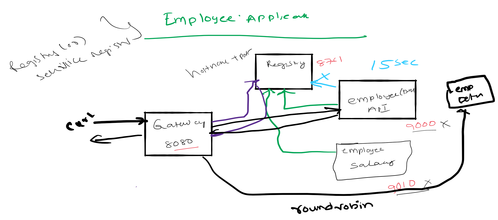

# Spring Cloud Session 3 Inter Microservice Communication Synchronous
In  this tutorial we are going to see how microservices communicate with each other. 
-There are two types of communication between microservice one is synchronous, and the other is asynchronous.
- In synchronous communication calling microservice **waits** till the called microservice responds.
- In asynchronous communication calling microservice will **not wait** till the called microservice responds.
- In this session we focus on Synchronous communication.
- There are two ways a microservice can communicate with other microservices
    - Direct: Microservice A speaks with  Microservice B Directly
    - Via Gateway: Instead of taking directly, Microservice A speaks with  Microservice B via gateway 
- This tutorial covers both the scenarios
- We will be developing report api which gives employee name,salary by communicating with employee-api,payroll-api
- For the purpose of this tutorial we developed two microservices
    - report-api-direct which calls employee-api,payroll-api directly
    - report-api-via-gateway calls employee-api,payroll-api via gateway
- **Note: In real world we favour to call microservices via a gateway even for inter communication. So I recommend using 
the  microservice report-api-via-gateway**  

**Overview**
- Run registry service on 8761. 
- Run employee-api service on dynamic port. Where it takes employee id and returns employee name.
- Run payroll-api service on dynamic port. Where it takes employee id and returns employee salary.
- Run report-api-direct service on dynamic port. Where it takes employee id and returns employee name and salary by 
directly communicating with employee-api and payroll-api.
- Run report-api-via-gateway service on dynamic port. Where it takes employee id and returns employee name and salary by 
directly communicating with employee-api and payroll-api indirectly via gateway.
- Run Gateway service on 8080 and reverse proxy requests to all the services (employee-api,payroll-api,report-api-direct,report-api-via-gateway)
- All the microservices (employee-api,payroll-api,report-api-direct,report-api-via-gateway,gateway) when they startup they register their service endpoint (rest api url)
 with registry
- Gateway Spring Cloud load balancer (Client side load balancing) component in Spring Cloud Gateway acts as reverse proxy.
It reads a registry for microservice endpoints and configures routes. 

Important Notes
- Netflix Eureka Server plays a role of Registry. Registry is a spring boot application with Eureka Server as dependency.
- Netflix Eureka Client is present in all the micro services (employee-api,payroll-api,report-api-direct,report-api-via-gateway,gateway) and they discover Eureka
server and register their availability with server.
- Generally Netflix Ribbon Component is used as Client Side load balancer, but it is deprecated project. We will be using
Spring Cloud Load balaner in gateway 
 

# Source Code 
``` git clone https://github.com/balajich/spring-cloud-session-3-inter-microservice-communication-sync.git``` 
# Video
[](https://www.youtube.com/watch?v=5WuallBaMnw)
- https://youtu.be/5WuallBaMnw
# Architecture

# Prerequisite
- JDK 1.8 or above
- Apache Maven 3.6.3 or above
# Clean and Build
- Java
    - ``` cd spring-cloud-session-3-inter-microservice-communication-sync ``` 
    - ``` mvn clean install ```
 
# Running components
- Registry: ``` java -jar .\registry\target\registry-0.0.1-SNAPSHOT.jar ```
- Employee API: ``` java -jar .\employee-api\target\employee-api-0.0.1-SNAPSHOT.jar ```
- Payroll API: ``` java -jar .\payroll-api\target\payroll-api-0.0.1-SNAPSHOT.jar ```
- Report API Direct: ``` java -jar .\report-api-direct\target\report-api-direct-0.0.1-SNAPSHOT.jar ```
- Report API via gateway: ``` java -jar .\report-api-via-gateway\target\report-api-via-gateway-0.0.1-SNAPSHOT.jar ```
- Gateway: ``` java -jar .\gateway\target\gateway-0.0.1-SNAPSHOT.jar ``` 

# Using curl to test environment
**Note I am running CURL on windows, if you have any issue. Please use postman client, its collection is available 
at spring-cloud-session-3-inter-microservice-communication-sync.postman_collection.json**
- Get employee report using report api ( direct): ``` curl -s -L  http://localhost:8080/report-api-direct/100 ```
- Get employee report using report-api-via-gateway: ``` curl -s -L  http://localhost:8080/report-api-via-gateway/100 ```

**Note: In real world we favour to call microservices via a gateway even for inter communication. So I recommend using 
the  microservice report-api-via-gateway**  
# Code
In this section will focus only on report-api and how communicates employee-api,payroll-api. 

*ReportController* in app **report-api-direct**. RestTemplate calls eureka ribbon client which fetches "employee-api,payroll-api" information from registry 
and calls the microservices directly. The **@LoadBalanced** annotation makes ribbon client to round-robbin requests if there are multiple instances of them.
```java
@Autowired
    RestTemplate restTemplate;

    @RequestMapping(value = "/report-api-direct/{employeeId}", method = RequestMethod.GET)
    public Employee getEmployeeDetails(@PathVariable int employeeId) {
        logger.info(String.format("Getting Complete Details of Employee with id %s", employeeId));
        //Get employee name from employee-api
        Employee responseEmployeeNameDetails = restTemplate.getForEntity("http://employee-api/employee/" + employeeId, Employee.class).getBody();
        //Get employee salary from payroll-api
        Employee responseEmployeePayDetails = restTemplate.getForEntity("http://payroll-api/payroll/" + employeeId, Employee.class).getBody();
        return new Employee(responseEmployeeNameDetails.getId(), responseEmployeeNameDetails.getName(), responseEmployeePayDetails.getSalary());
    }

    @Bean
    @LoadBalanced
    public RestTemplate restTemplate() {
        return new RestTemplate();
    }
```
*ReportController* in app **report-api-via-gateway**. RestTemplate calls eureka ribbon client which fetches "gateway" information from registry 
and calls the employee,payroll api via gateway. The **@LoadBalanced** annotation makes ribbon client to round-robbin requests if there are multiple instances of them.
```java
  @Autowired
    RestTemplate restTemplate;

    @RequestMapping(value = "/report-api-via-gateway/{employeeId}", method = RequestMethod.GET)
    public Employee getEmployeeDetails(@PathVariable int employeeId) {
        logger.info(String.format("Getting Complete Details of Employee with id %s", employeeId));
        //Get employee name from employee-api via gateway
        Employee responseEmployeeNameDetails = restTemplate.getForEntity("http://gateway/employee/" + employeeId, Employee.class).getBody();
        //Get employee salary from payroll-api via gateway
        Employee responseEmployeePayDetails = restTemplate.getForEntity("http://gateway/payroll/" + employeeId, Employee.class).getBody();
        return new Employee(responseEmployeeNameDetails.getId(), responseEmployeeNameDetails.getName(), responseEmployeePayDetails.getSalary());
    }

    @Bean
    @LoadBalanced
    public RestTemplate restTemplate() {
        return new RestTemplate();
    }
```
**Gateway**
```yaml
cloud:
    loadbalancer:
      ribbon:
        enabled: false
    gateway:
      routes:
        - id: employee-api
          uri: lb://EMPLOYEE-API
          predicates:
            - Path=/employee/**
        - id: payroll-api
          uri: lb://PAYROLL-API
          predicates:
            - Path=/payroll/**
        - id: report-api-direct
          uri: lb://REPORT-API-DIRECT
          predicates:
            - Path=/report-api-direct/**
        - id: report-api-via-gateway
          uri: lb://REPORT-API-VIA-GATEWAY
          predicates:
            - Path=/report-api-via-gateway/**
```

# Next Steps
- Inter microservice communication in asynchronous fashion

# References
- Spring Microservices in Action by John Carnell 
- Hands-On Microservices with Spring Boot and Spring Cloud: Build and deploy Java microservices 
using Spring Cloud, Istio, and Kubernetes -Magnus Larsson 
# Next Tutorial
https://github.com/balajich/spring-cloud-session-4-inter-microservice-communication-async