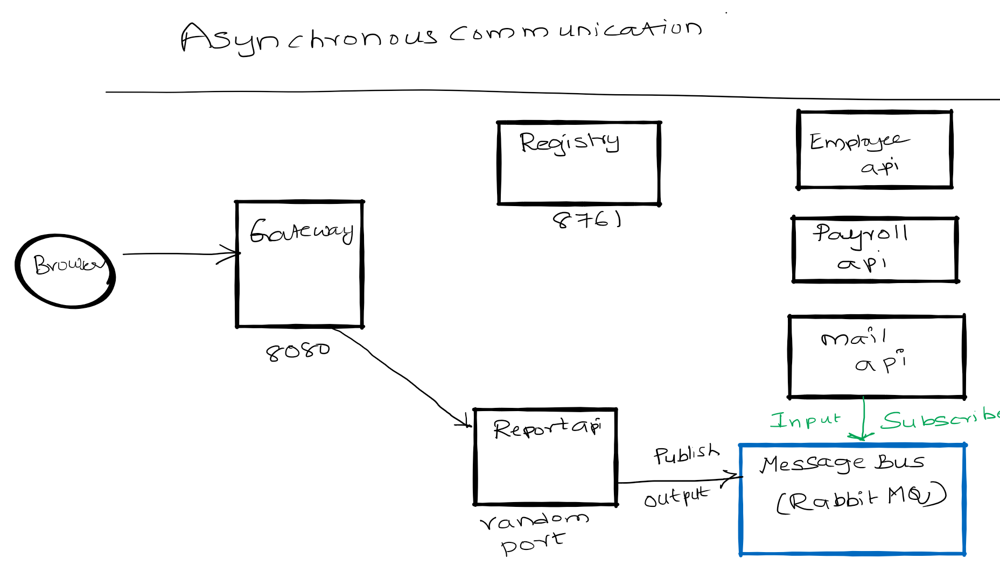

# Spring Cloud Session 4 Inter Microservice Communication ASynchronous using RabbitMQ
In  this tutorial we are going to learn how microservices communicate with each other in asynchronous fashion. In asynchronous 
communication calling microservice will **not wait** till the called microservice responds. This pattern can be achieved 
with message bus infrastructures like Kafka or RabbitMQ.Here we use **Spring Cloud Stream** framework to communicate 
with message bus.

**Overview**
- When report-api microservice receives a request to get employee details it is going to fetch details and write results
to message bus.
- Mail microservice listens on the bus for employee details and when those details are available on bus. It is going to read
send SMS and email.  
- report-api play a role of **Producer**
- mail-client microservice plays a role of **Consumer**
- RabbitMQ play a role of mediator or **message bus**

**Flow**
- Run RabbitMQ server, it binds to port 5672 and admin ui (Control Center web interface) application to port 9021.
- Run registry service on 8761. 
- Run employee-api service on dynamic port. Where it takes employee id and returns employee name.
- Run payroll-api service on dynamic port. Where it takes employee id and returns employee salary.
- Run report-api service on dynamic port. Where it takes employee id and returns employee name and salary by 
directly communicating with employee-api and payroll-api. **It also publishes employee details to message bus**
- Run mail-client service (it is not a rest api, it a java process and doesnt bind to any port). **Where it subscribes
 to message bus** for employee details message and sends mail,sms.
- Run Gateway service on 8080 and reverse proxy requests to all the services (employee-api,payroll-api,report-api)
- All the microservices (employee-api,payroll-api,report-api,gateway) when they startup they register their service endpoint (rest api url)
 with registry
- Gateway Spring Cloud load balancer (Client side load balancing) component in Spring Cloud Gateway acts as reverse proxy.
It reads a registry for microservice endpoints and configures routes. 

Important Notes
- Netflix Eureka Server plays a role of Registry. Registry is a spring boot application with Eureka Server as dependency.
- Netflix Eureka Client is present in all the micro services (employee-api,payroll-api,report-api,gateway) and they discover Eureka
server and register their availability with server.
- Generally Netflix Ribbon Component is used as Client Side load balancer, but it is deprecated project. We will be using
Spring Cloud Load balaner in gateway 
# RabbitMQ Terminology
- **Producer, publisher** A Producer is the application that is sending the messages to the message queue.
- **Consumer** A Consumer is the application that receives the messages from the message queue.
- **Message queue**- A message queue is a queue of messages sent between applications. 
It allow applications to communicate by sending messages to each other.
- **Exchange** An exchange is responsible for the routing of the messages to the different queues. An exchange accepts 
messages from the producer application and routes them to message queues with help of header attributes, bindings, 
and routing keys
- **Ack** When RabbitMQ delivers a message to a consumer, it needs to know when to consider the message successfully 
sent. An ack will acknowledge one or more messages, which tells RabbitMQ that a message/messages has been handled
- **Binding**  A binding is a "link" that you set up to bind a queue to an exchange.
- **Channel** A channel is a virtual connection inside a connection. When you are publishing or consuming messages 
from a queue - it's all done over a channel.
- **Connection**-A connection is a TCP connection between your application, and the RabbitMQ broker
# Spring Cloud Stream Concepts
Spring cloud stream abstracts underneath communication  with Messagebus. This helps to foucs on business logic instead of 
 nettigritty of message bus. We can easily switch from RabbitMQ to Kafka etc without code changes.
 - **Bindings** — a collection of interfaces that identify the input and output channels.
- **Channel** — represents the communication pipe between messaging-middleware and the application.
- **StreamListeners**- Listens to messages on Input channel and serializes them to java objects.
 

# Source Code 
``` git clone https://github.com/balajich/spring-cloud-session-4-inter-microservice-communication-async.git``` 
# Video
[](https://www.youtube.com/watch?v=8CV8PDX8Kuc)
- https://youtu.be/8CV8PDX8Kuc
# Architecture

# Prerequisite
- JDK 1.8 or above
- Apache Maven 3.6.3 or above
- Vagrant, Virtualbox (To run RabbitMQ Server)
# Start RabbitMQ Server and Build Microservices
We will be running RabbitMQ server inside a docker container. I am running docker container on CentOS7 virtual machine. 
I will be using vagrant to stop or start a virtual machine.
- RabbitMQ Server
    - ``` cd spring-cloud-session-4-inter-microservice-communication-async ```
    - Bring virtual machine up ``` vagrant up ```
    - ssh to virtual machine ```vagrant ssh ```
    - Switch to root user ``` sudo su - ```
    - Change folder where docker-compose files is available ```cd /vagrant```
    - Start RabbitMQ Server using docker-compose ``` docker-compose up -d ```
- Java
    - ``` mvn clean install ```
# RabbitMQ Server UI

# Running components
- Registry: ``` java -jar .\registry\target\registry-0.0.1-SNAPSHOT.jar ```
- Employee API: ``` java -jar .\employee-api\target\employee-api-0.0.1-SNAPSHOT.jar ```
- Payroll API: ``` java -jar .\payroll-api\target\payroll-api-0.0.1-SNAPSHOT.jar ```
- Report API: ``` java -jar .\report-api\target\report-api-0.0.1-SNAPSHOT.jar ```
- Mail Client App: ``` java -jar .\mail-client\target\mail-client-0.0.1-SNAPSHOT.jar ```
- Gateway: ``` java -jar .\gateway\target\gateway-0.0.1-SNAPSHOT.jar ``` 

# Using curl to test environment
**Note I am running CURL on windows, if you have any issue. Please use postman client, its collection is available 
at spring-cloud-session-3-inter-microservice-communication-sync.postman_collection.json**
- Access RabbitMQ UI: ```http://localhost:15672/  ```
- RabbitMQ defaults username/password: ``` guest/guest ```
- Get employee report using report api ( direct): ``` curl -s -L  http://localhost:8080/report-api/100 ```

  
# Code
In this section will focus only on report-api code which publishes employee details to queue **queue.email** 

*ReportController* in app **report-api**.  @SendTo(Processor.OUTPUT) makes the function to invoke RabbitMQ and writes
details to MQ.
```java
    @SendTo(Processor.OUTPUT)
    public Employee getEmployeeDetails(@PathVariable int employeeId) {
       
        Employee finalEmployee = new Employee(responseEmployeeNameDetails.getId(), responseEmployeeNameDetails.getName(), responseEmployeePayDetails.getSalary());
        // Send to message bus
        processor.output().send(MessageBuilder.withPayload(finalEmployee).build());
       
    }
```
**application.yml** in report-api. 
```yaml
 cloud:
    stream:
      bindings:
        output:
          destination: queue.email
          binder: local_rabbit
      binders:
        local_rabbit:
          type: rabbit
          environment:
            spring:
              rabbitmq:
                host: localhost
                port: 5672
                username: guest
                password: guest
                virtual-host: /
```
mail-client code that reads messages from queue. @StreamListener(Processor.INPUT) reads data from queue **email.queue**
```java
@SpringBootApplication
@EnableBinding(Processor.class)
public class MailClientApplication {

    public static void main(String[] args) {
        SpringApplication.run(MailClientApplication.class, args);
    }

    @StreamListener(Processor.INPUT)
    public void receivedEmail(Employee employee) {
        System.out.println("Received employee details: " + employee);
        System.out.println("Sending email and sms: "+employee.getName());
    }

}
```
**application.yml** of mail-client
```yaml
application:
    name: email-api
  cloud:
    stream:
      bindings:
        input:
          destination: queue.email
          binder: local_rabbit
          group: emailconsumers
      binders:
        local_rabbit:
          type: rabbit
          environment:
            spring:
              rabbitmq:
                host: localhost
                port: 5672
                username: guest
                password: guest
                virtual-host: /
```
# References
- https://www.baeldung.com/spring-cloud-stream
- Spring Microservices in Action by John Carnell 
- Hands-On Microservices with Spring Boot and Spring Cloud: Build and deploy Java microservices 
using Spring Cloud, Istio, and Kubernetes -Magnus Larsson
- https://www.cloudamqp.com/blog/2017-07-25-RabbitMQ-and-AMQP-concepts-glossary.html 
# FAQ
- https://github.com/balajich/Spring-Cloud-Sessions-Microservices-FAQ/blob/master/README.md
# Next Tutorial
We will learn how to use kafka as message bus
- https://github.com/balajich/spring-cloud-session-4-inter-microservice-communication-async-kafka